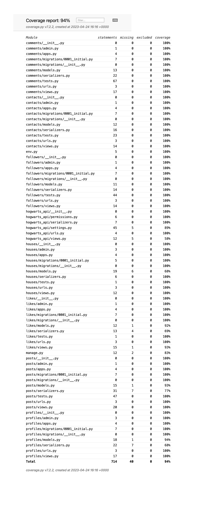

## Coverage Report

- [Coverage.py](https://coverage.readthedocs.io/en/7.2.3/) is a tool for measuring code coverage of Python programs. It monitors your program, noting which parts of the code have been executed, then analyzes the source to identify code that could have been executed but was not.
- Coverage measurement is typically used to gauge the effectiveness of tests. It can show which parts of your code are being exercised by tests, and which are not.

### Hogwart - API Coverage Report

   * 

Return to [README.md](README.md) :book:
