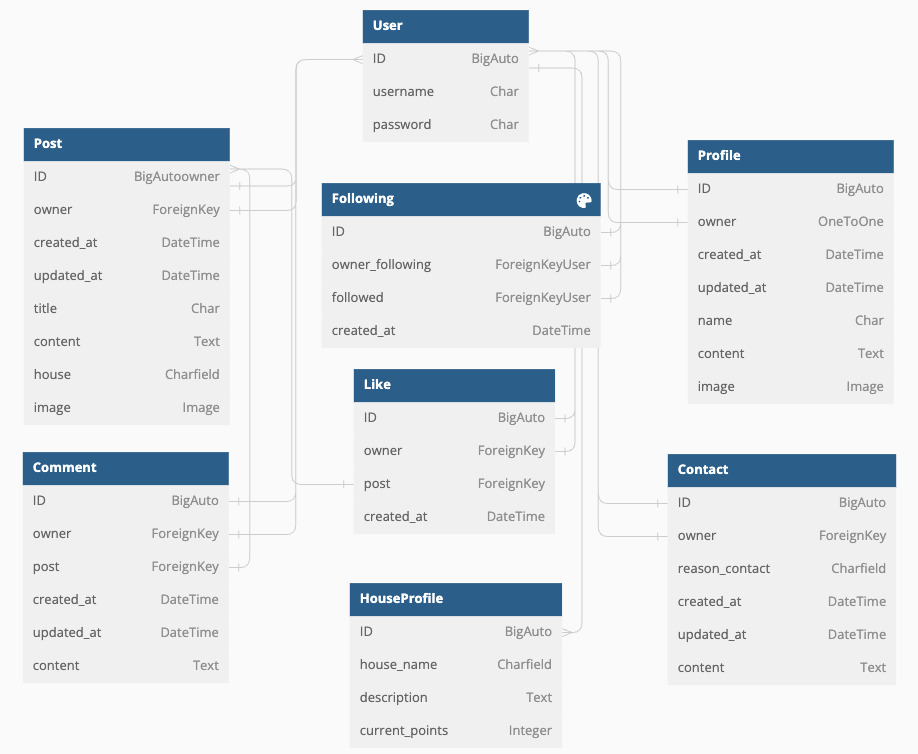

# Hogwarts API

Hogwarts is a social media platform that has been created based on the beloved Harry Potter saga. The main objective of this platform is to enable users to view posts that are related to the saga. Users who have registered on the platform are able to list posts and access the content that is contained within them.

This project contains the API portion of the platform which has been created using the [Django REST framework](https://www.django-rest-framework.org/). This API serves as the authentication information and functionality for the front end of the project.

The platform has implemented a custom user template which restricts functionality based on the type of user account that has been authenticated:
  - Only registered users can create, update, and delete posts.
  - Registered users can follow, like, and comment on posts.
  - A user's profile can be viewed by other users and visitors.
  - Profile update functionality is restricted to the profile owner.
  - The CRUD functionality for Likes, Followers, Contacts and Comments is restricted to the respective user."


## Demo

- [API - Live Deployment Link](https://hogwarts-hp.herokuapp.com/)

### Frontend Project Links

- [Frontend - Repository](https://github.com/llancruzz/hogwarts)
- [Frontend - Deployment](https://hogwarts-hf.herokuapp.com/)

## Table Of Contents:

- [User Stories and Tasks](#user-stories-and-tasks)
- [Database Schema](#database-schema)
  - [Future Features](#future-features)
- [Testing](#testing)
- [Technologies Used](#technologies-used)
  - [Languages and Frameworks Used](#languages-and-frameworks-used)
  - [Python Modules Used](#python-modules-used)
  - [Packages Used](#packages-used)
  - [Programs and Tools Used](#programs-and-tools-used)
- [Deployment](#deployment)
  - [Create a Database](#create-a-database)
  - [Forking the GitHub Repository](#forking-the-github-repository)
  - [Making a Local Clone](#making-a-local-clone)
  - [Deploying with Heroku](#deploying-with-heroku)
- [Credits](#credits)
  - [Online resources](#online-resources)
  - [Code Institute](#code)
  - [Acknowledgments](#acknowledgments)

## User Stories and Tasks

Development of the API was in service of delivering users stories created for the frontend project. All user stories have been documented in a separate file which can be viewed [here](https://github.com/llancruzz/hogwarts/blob/main/USERSTORIES.md).

Development tasks for the API were created as issues and linked to the projects Kanban board which can be found [here](https://github.com/users/llancruzz/projects/10/views/1).

## Database Schema

Models were created based on the database schema design as below. The CustomUser model was created first as this extended the AbstractUser class to allowed users to be added to accounts to separate functionality. The remaining models were then created as required by the user stories.



### Future Features

- Chat messages to allow users to interact with each other.
- Share button post, to allow users to share their posts on other social media such as Facebook, Twitter and so on.
- Save posts button, to allow users to review the posts later.

## Testing

A separate testing document has been created as [TESTING.md](TESTING.md)
A coverage testing document report has been created as [COVERAGE.md](COVERAGE.md)

## Technologies Used

### Languages and Frameworks Used

- [Python](https://www.python.org/) - Python is a programming language that lets you work quickly
and integrate systems more effectively
- [Django](https://pypi.org/project/Django/3.2.14/) - High-level Python Web framework used to develop the project.
- [djangorestframework](https://pypi.org/project/djangorestframework/3.14.0/) - Toolkit for building web API's with Django.

### Python Modules Used

- Built-in Packages/Modules
  - [pathlib](https://docs.python.org/3/library/pathlib.html) - Used to work with filepaths.
  - [os](https://docs.python.org/3/library/os.html) - This module provides a portable way of using operating system dependent functionality.

### Packages Used

- External Python Packages
  - [cloudinary](https://pypi.org/project/cloudinary/1.30.0/) - Cloudinary intergration.
  - [django-cloudinary-storage](https://pypi.org/project/django-cloudinary-storage/0.3.0/) - Cloudinary intergration.
  - [dj-database-url](https://pypi.org/project/dj-database-url/0.5.0/) - Allows the use of 'DATABASE_URL' environmental variable in the Django project settings file to connect to a PostgreSQL database.
  - [django-allauth](https://pypi.org/project/django-allauth/0.51.0/) - Set of Django application used for account registration, management and authentication.
  - [dj-rest-auth](https://pypi.org/project/dj-rest-auth/2.2.5/) - API endpoints for handling authentication in Django Rest Framework.
  - [django-filter](https://pypi.org/project/django-filter/22.1/) - Application that allows dynamic QuerySet filtering from URL parameters.
  - [djangorestframework-simplejwt](https://pypi.org/project/djangorestframework-simplejwt/5.2.1/) - JSON Web Token authentication backend for the Django REST Framework.
  - [django-cors-headers](https://pypi.org/project/django-cors-headers/3.13.0/) - Django App that adds CORS headers to responses.
  - [gunicorn](https://pypi.org/project/gunicorn/20.1.0/) - Python WSGI HTTP Server.
  - [Pillow](https://pypi.org/project/Pillow/9.2.0/) - Fork of PIL, the Python Imaging Library which provides image processing capabilities.
  - [psycopg2](https://pypi.org/project/psycopg2/2.9.3/) - Python PostgreSQL database adapter.
  - [python-dotenv](https://pypi.org/project/python-dotenv/0.21.0/) - Set key-value pairs from `.env` file as environmental variables.
  - [coverage](https://coverage.readthedocs.io/en/7.2.3/). - Coverage measurement is typically used to gauge the effectiveness of tests. It can show which parts of your code are being exercised by tests, and which are not.

### Programs and Tools Used

- [dbdiagram](https://dbdiagram.io/home) - Create Database Schema/Entity-Relationship Diagrams
- [Gitpod:](https://www.gitpod.io/)
  - Gitpod was used as my code editor for this project.
- [Git](https://git-scm.com/)
  - Git was used for version control, using the terminal to commit to Git and
    Push to GitHub.
- [GitHub:](https://github.com/)
  - GitHub is used to store the projects code after being pushed from Git.
- The following modules were installed or enabled in [Gitpode Code](https://www.gitpod.io/) to assist with formatting and code
linting:
  - [flake8](https://github.com/pycqa/flake8) - Code Linter
  - [black](https://github.com/psf/black) - Code Formatter

## Deployment


### Create a Database
Create a new PostgreSQL database instance.

#### Process
1. Log in to [ElephantSQL.com](https://customer.elephantsql.com/login) to access your dashboard.
   - *Note: If you don't have an ElephantSQL.com account yet, [click here to sign up](https://customer.elephantsql.com/signup).*
1. Click “Create New Instance”
1. Set up your plan:
   - Give your plan a Name (this is commonly the name of the project).
   - Select the Tiny Turtle (Free) plan.
   - You can leave the Tags field blank.
1. Select “Select Region”.
1. Select a data center near you.
1. Then click “Review”.
1. Check your details are correct and then click “Create instance”.
1. Return to the ElephantSQL dashboard and click on the database instance name for this project.
1. In the URL section, click the copy icon to copy the database URL.

### Forking the GitHub Repository

By forking the GitHub Repository we make a copy of the original repository on
our GitHub account to view and/or make changes without affecting the original
repository by using the following steps...

1. Log in to GitHub and locate the [GitHub
   Repository](https://github.com/llancruzz/hogwarts-api)
1. At the top of the Repository (not top of page) just above the "Settings"
   Button on the menu, locate the "Fork" Button.
1. Click the button (not the number to the right) and you should now have a copy
   of the original repository in your GitHub account.

### Making a Local Clone

**NOTE**: It is a requirement of the project that you have Python version 3.8 or higher installed locally.

1. Log in to GitHub and locate the [GitHub Repository](https://github.com/llancruzz/hogwarts-api).
1. Under the repository name, click "Code".
1. To clone the repository using HTTPS, under "HTTPS", copy the link.
1. Open your local terminal with git installed
1. Change the current working directory to the location where you want the cloned directory to be created.
1. Type `git clone`, and then paste the URL you copied in Step 3.

    ```console
    ~$ git clone https://github.com/llancruzz/hogwarts-api.git
    ```

1. Press Enter. Your local clone will be created.

    ```console
    $ git clone https://github.com/llancruzz/hogwarts-api.git
    > Cloning into `test-dir`...
    > remote: Counting objects: 10, done.
    > remote: Compressing objects: 100% (8/8), done.
    > remove: Total 10 (delta 1), reused 10 (delta 1)
    > Unpacking objects: 100% (10/10), done.
    ```

    [Click here](https://help.github.com/en/github/creating-cloning-and-archiving-repositories/cloning-a-repository#cloning-a-repository-to-github-desktop) for a more detailed explanation of the process above with pictures.

1. Change the current working directory to the cloned project folder (this will be a child directory in the location you cloned the project).

1. It is recommended to use a virtual environment during development ([learn more about virtual environments](https://realpython.com/python-virtual-environments-a-primer/)). If you would prefer not to use one please skip the following steps:
    1. Create a virtual environment in the projects working directory by entering the following command in the same terminal window used for the steps above `python3 -m venv .venv`.
    1. Before use, the virtual environment will need to be activated using the command `source .venv/bin/activate` in the same terminal window used previously.
1. Packages required by the project can now using the command `pip install -r requirements.txt`
1. In the cloned directory, rename the file `.env-example` to `.env` and populate it with the information required.
1. Make Django migrations using the command `./manage.py migrate`.

### Deploying with Heroku

**NOTE**: It is a prerequisite of deployment to Heroku that you already have access to the following:

- A Cloudinary account, create one for free at [https://cloudinary.com](https://cloudinary.com).

**NOTE**: It is assumed you have followed all deployment instructions listed in this readme starting with the section titled 'Forking the GitHub Repository'.

1. Log in to [Heroku](https://www.heroku.com/) and if not taken there automatically, navigate to your personal app dashboard.
1. At the top of the page locate the 'New' drop down, click it and then select 'Create new app'.
1. Give your application a unique name, select a region appropriate to your location and click the 'Create app' button.
1. Your app should now be created, so from the menu towards the top of the page select the 'Resources' section.
1. Search for 'Heroku Postgres' under the Add-ons section and add it.
1. From the menu towards the top of the page select the 'Settings' section and lick 'Reveal Config Vars' in the Config vars section. Enter the following key / value pairings:
    1. Key as `ALLOWED_HOSTS` and the value as the name of you project with '.herokuapp.com' appended to the end e.g.  `example-app.herokuapp.com`. Click the Add button.
    1. Key as `CLOUDINARY_URL` and the value as your cloudinary API Environment variable e.g. `cloudinary://**************:**************@*********`. Click the Add button.
    1. Key as `SECRET_KEY` and the value as a complex string which will be used to provide cryptographic signing. The use of a secret key generator is recommended such as [https://djecrety.ir](https://djecrety.ir/). Click the Add button.
    1. Ensure the key `DATABASE_URL` is already populated. This should have been created automatically by Heroku.
    1. The `DATABASE_URL` should be copied from ElephantSQL dashboard your local `DETAILS`, created during the creating a new database process.
    1. To make authenticated requests to this API (e.g. from a fontend application) you are required to add the key `CLIENT_ORIGIN` with the value set as the URL you will be sending the authentication request from.
    1. Additionally, a `CLIENT_ORIGIN_DEV` key can be set with the value of a development server (IP or URL) for use during local development.
1. Open the `.env` file in the project directory and delete the key / value pair `DEV_ENVIRONMENT_DATABASE = True` before saving the file. This can be added back after the next step to ensure local development changes will not alter the remote database.
1. Navigate to the 'Deploy' page using the menu towards the top of the page.
1. Select 'GitHub' from the 'Deployment method' section and you will be prompted to 'Connect to GitHub'.
1. Once connected to your GitHub account you will be able to search for your repository which contains the forked 'hogwarts-api' repository.
1. Once the repository is found click 'Connect'.
1. At the bottom of the page find the section named 'Manual deploy', select the 'main' branch in the drop down and click the 'Deploy' button.
1. Once deployment is complete, click the 'View' button to load the URL of the deployed application.

## Credits

### Online resources

- [Django Documentation](https://docs.djangoproject.com/en/3.2/)
- [Django REST Documentation](https://www.django-rest-framework.org/)
- [Python Documentation](https://docs.python.org/3/)
- [Stack Overflow](https://stackoverflow.com/)

### Code

- Code Institute DRF Tutorial Project, used through as a basis for the creation of this API
  - CREDIT: Code Institute DRF-API Tutuorial Project
  - URL: [https://github.com/Code-Institute-Solutions/drf-api](https://github.com/Code-Institute-Solutions/drf-api)

### Acknowledgments

A huge thank you to my partner for his patience and support throughout this project.
